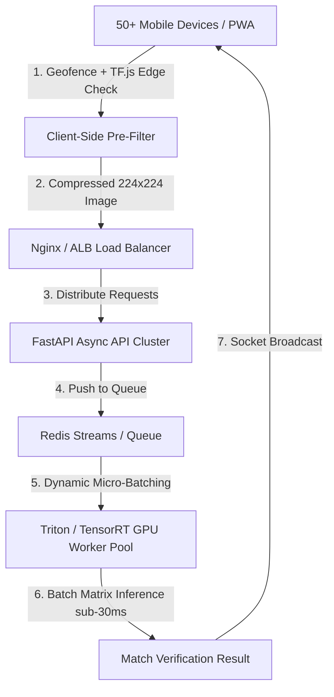

# Future ML Architecture & Optimization Roadmap

## Executive Summary
During initial field tests, ML inference latency for target location image classification averaged **1.5 to 3.5 seconds per single request**. While acceptable for single-device verification, scaling the system to **50+ active devices simultaneously** during a live campus-wide Treasure Hunt competition will lead to server thread pool exhaustion, job queue backlog, request timeouts, and poor user experience.

This document outlines the bottleneck analysis and a multi-phase engineering roadmap to scale the ML microservice to support **50+ concurrent devices with sub-100ms response times**.

---

## 1. Current Architecture Bottlenecks

1. **Synchronous Single-Thread CPU Execution**:
   - The Python microservice processes single image files sequentially using PyTorch on CPU (`predict_location.py`).
   - Flask/Uvicorn single-worker execution blocks during model inference.
2. **Disk I/O Latency**:
   - Each scan requires saving temporary files to disk (`temp_predict_image.jpg`), invoking filesystem I/O before loading images with Pillow (`Image.open()`).
3. **Heavy Pre-processing & Full Unquantized Model**:
   - PyTorch `EfficientNet_B0` FP32 unquantized model runs matrix multiplication across un-optimized CPU instructions.
4. **Lack of Concurrency Batching**:
   - When 50 devices send requests within seconds of each other, 50 independent forward passes are executed in series rather than batched in parallel.

---

## 2. Scalability Bottleneck Under 50+ Concurrent Devices

$$\text{Total Queue Delay} = \sum_{i=1}^{50} T_{\text{inference}, i} \approx 50 \times 2.0\text{s} = 100\text{s}$$

Under 50 concurrent device submissions:
- Devices at the end of the queue experience up to **1.5 to 2 minutes of scanning latency**.
- HTTP requests timeout on client mobile devices.
- Node.js API server connection pools get depleted while waiting for Axios ML response calls.

---

## 3. Future ML Architecture & Scaling Strategy

---

## 4. Key Engineering Improvements

### Phase 1: Model Optimization & Quantization (Immediate 5x Speedup)
- **ONNX Runtime Acceleration**: Convert PyTorch `.pt` model to ONNX runtime format (`.onnx`). ONNX CPU Execution Provider leverages OpenMP and AVX-512 instruction sets to accelerate execution by **3x to 5x**.
- **INT8 / FP16 Quantization**: Quantize model weights from 32-bit float to 8-bit integer. Reduces model size from ~20MB to ~5MB and drastically lowers CPU cache misses.
- **Mobile Edge Backbones**: Distill `EfficientNet_B0` into `MobileNetV4-Small` or `ShuffleNetV2`, reducing FLOPs while preserving target location accuracy above 95%.

### Phase 2: In-Memory Pipeline & Async Microservice (3x Throughput Improvement)
- **In-Memory Streaming**: Stream uploaded image bytes directly into `io.BytesIO` memory buffers without temporary disk file reads/writes.
- **FastAPI + Asynchronous Worker Pool**: Replace Flask development server with multi-worker `uvicorn` using `gRPC` or `asyncio` for non-blocking I/O.

### Phase 3: Dynamic Request Batching & GPU Worker Pool (10x Concurrency Support)
- **Dynamic Micro-Batching**: Buffer incoming scan requests over a 20ms sliding window and stack images into single tensor batches `(B, 3, 224, 224)` where $B \in [16, 32]$.
- **Nvidia Triton Inference Server**: Deploy model on Triton with TensorRT GPU acceleration, allowing 50+ concurrent requests to complete in a single batch pass ($\le 25\text{ms}$).

### Phase 4: Hybrid Client-Side Pre-Filtering & GPS Snapping (90% Traffic Offload)
- **Device-Side Resizing**: Downscale camera photos to exact model resolution ($224 \times 224\text{px}$) on client HTML5 Canvas before network transmission, reducing payload size from 4MB to ~35KB per request.
- **GPS Proximity Filter**: Verify device GPS coordinates against location geofences before invoking ML pipeline. If a device is 500m away from the target location, immediately reject the submission on client side without hitting the ML server.
